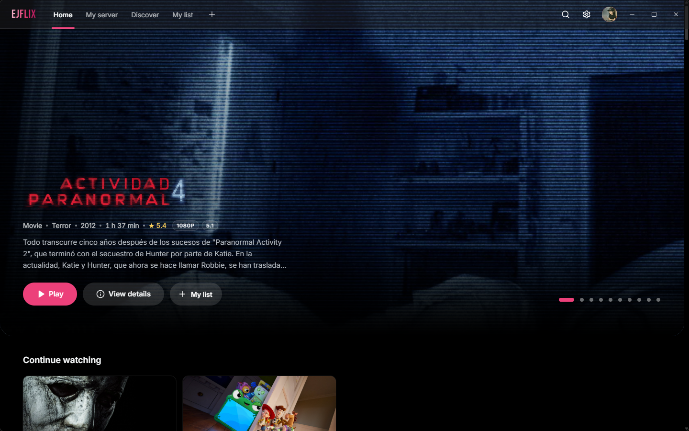
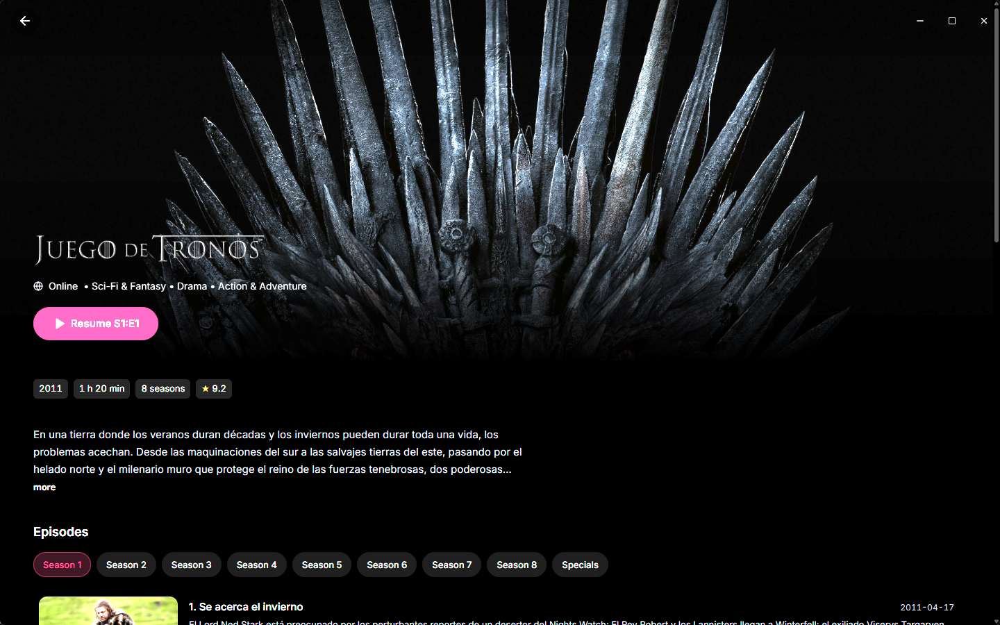
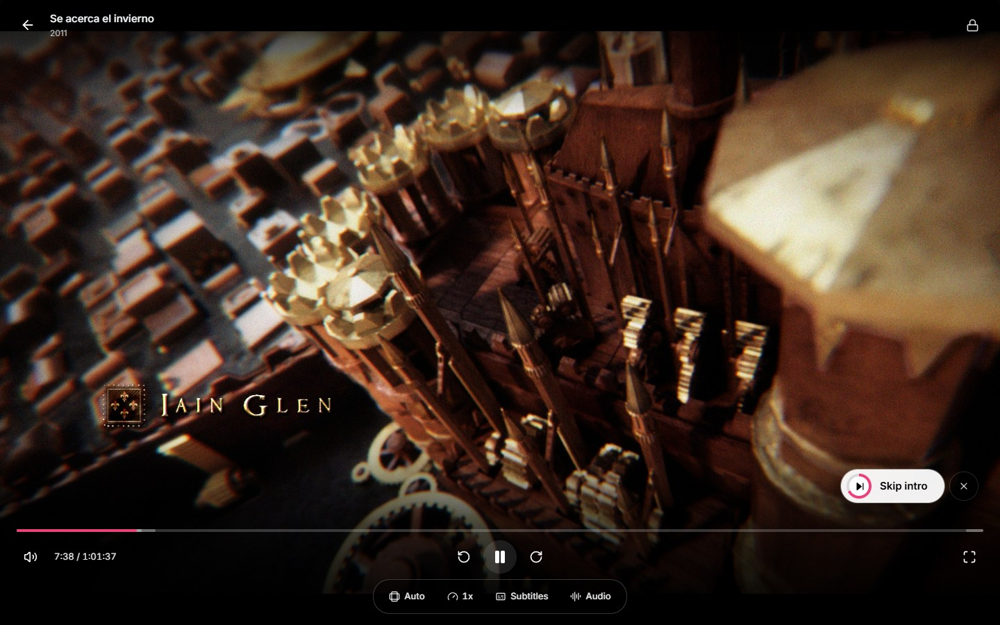
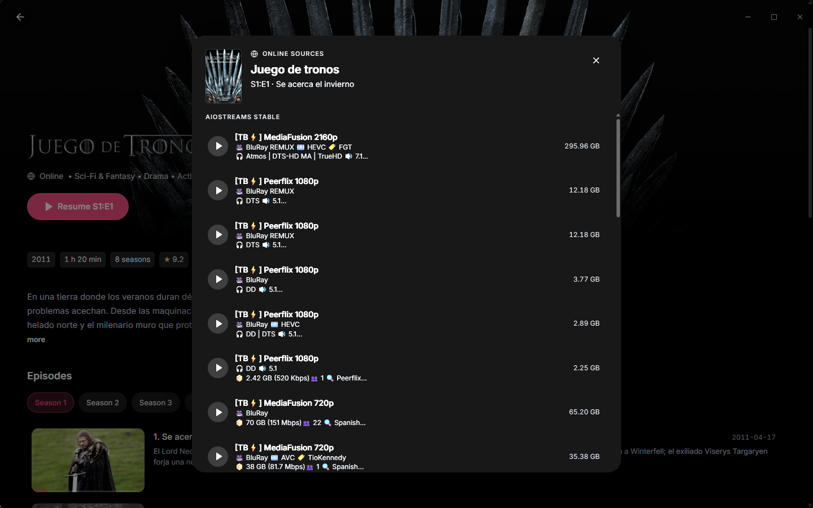
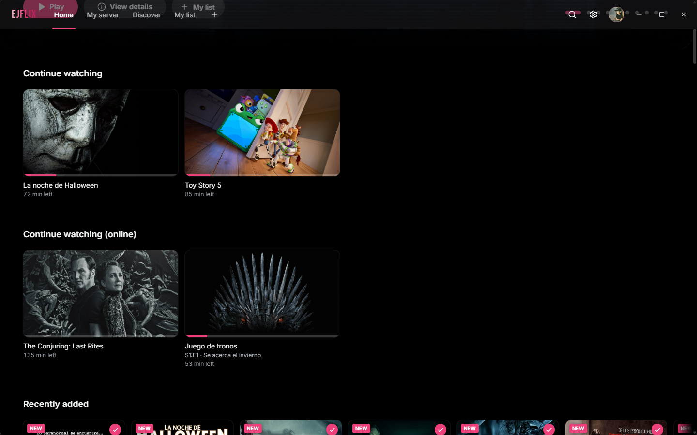

<div align="center">


# ejFlix

**A Jellyfin client for Windows 11 that also works without a server.**
Video plays natively in mpv — 4K, HDR, original codec, no transcoding.

[](../../releases/latest)
[](../../actions/workflows/release.yml)
[](LICENSE)




</div>

## What it is

Point it at your Jellyfin server and it plays your library. Point it at nothing and it
still works: create a local profile and it browses public catalogs, plays sources from
your Stremio addons and tunes your IPTV lists. Everything goes through one mpv window,
so a 4K HDR remux plays as itself instead of being transcoded down.

Spanish and English, per profile, and it updates itself from GitHub Releases.

## Install

Download `ejFlix_*_x64-setup.exe` from **[Releases](../../releases/latest)**. It installs
per user and needs no admin rights.

On first launch pick **"I have a Jellyfin server"** and enter its URL (say
`http://192.168.1.10:8096`), or **"Watch online with addons"** and make a local profile.

<details>
<summary><b>Windows says "protected your PC"</b></summary>

<br>

The installer is not signed yet, so SmartScreen warns the first time you run it, and a
new build is unknown to antivirus engines until enough people have run it. Click
**More info → Run anyway**, or right-click the file → Properties → **Unblock**.

If you would rather check before trusting it: the installer is built by
[GitHub Actions](.github/workflows/release.yml) on a clean runner, and the run log for
each release shows exactly what went into it.

</details>

## Features

**Your library** — Home with a hero carousel, continue watching, next up, My list and
genre rows. Details pages with the backdrop tinted by its own dominant colour, seasons,
cast, chapters and what to watch next. Discover with genre and year filters. Search that
answers as you type.

**The player** — Direct Play in mpv with hardware decoding and HDR. Scene previews when
you drag the timeline, skip intro / recap / credits, a next-episode card, an episode
panel you can open mid-film, per-profile audio and subtitle languages, and a lock for
the controls.

**Without a server** — Local profiles with an optional PIN. Stremio addons feed the
catalogs and the sources; pick one and it plays in the same mpv, remembers where you
left it and chains the next episode on its own. Sources can be filtered by quality,
availability and language, or downloaded to disk.

**Live TV** — M3U playlists and Xtream Codes accounts with their XMLTV guide, groups,
favourites and zapping from inside the player.

**Your account** — Optional. Sign up from the app or at [ejflix.xyz](https://ejflix.xyz)
(email confirmation, two-step verification, password recovery) and your servers,
addons, IPTV lists, My list, watched titles and progress follow you from one PC to the
next. The website manages all of it, plus your devices. Local profiles work without it.

**The rest** — Twelve accent themes plus AMOLED black, Discord Rich Presence, and
updates that install themselves in one click.

<div align="center">

| | |
| :---: | :---: |
| <br>Details | <br>Player, skipping the intro |
| <br>Online sources | <br>Continue watching |

</div>

## Guides

<details>
<summary><b>With a Jellyfin server</b></summary>

<br>

Enter the server URL and pick a user. The access token is encrypted for the current
Windows account; passwords are never stored, and image or stream URLs never carry an
`api_key`.

Two server-side settings are worth turning on:

- **Scene previews** need trickplay images (Jellyfin 10.9+). Enable *Trickplay image
  extraction* in the library settings, then run the *Generate Trickplay Images*
  scheduled task once. Without them the player falls back to chapter images.
- **"Recently added"** follows Jellyfin's `DateCreated`. If your library uses the file
  creation date, set *Date added behavior for new content* to *Use date scanned into the
  library* so new imports actually show up first.

</details>

<details>
<summary><b>Without a server: Stremio addons</b></summary>

<br>

Pick *Watch online with addons* on the welcome screen and create a profile. Cinemeta is
built in for the popular rows and the metadata; add your own `manifest.json` in
**Settings › Addons** (an AIOStreams or Torrentio configuration carrying your debrid
key, for example) to get sources.

- The addon's catalogs become rows on Home and feed Discover and search.
- Opening a title lists the streams of every addon that serves it. Only http(s) streams
  play directly: raw torrents (`infoHash`) are listed but disabled, which is not a
  problem with a debrid-backed addon.
- A title is carried by its IMDb id whenever one is known, and asked for under both its
  own id and that one, because torrent addons only index IMDb. Without this, a title
  from a TMDB catalog reaches barely half of the sources.
- Progress is kept locally per profile, the next episode chains automatically preferring
  the same addon, and intro skipping works through IntroDB by IMDb id.
- Jellyfin movies and episodes that have an IMDb id get an *Online sources* button too,
  handy for episodes your library is missing.

The Jellyfin token is never sent to an addon host; only the headers the addon itself
asks for travel with the stream request.

</details>

<details>
<summary><b>Downloading a source</b></summary>

<br>

Every source carries a three-dot menu with **Download** and **Copy link**. Files go to
`Downloads\ejFlix` under the name the addon reports; an existing file is never
overwritten, and a download in flight is written as `<name>.part`, so cancelling leaves
nothing behind.

The header icon shows what is running, with progress, cancel and a shortcut that opens
the finished file in Explorer. Three downloads run at a time and the list survives
restarts. Rust does the downloading with the addon's own headers, so the stream URL —
which often carries a debrid key — never leaves the backend.

</details>

<details>
<summary><b>Live TV (IPTV)</b></summary>

<br>

**Settings › IPTV** takes up to 12 sources per profile: an **M3U/M3U8 playlist by URL**
(the usual `get.php?…&type=m3u_plus` link works), an **M3U file** from disk, or an
**Xtream Codes** account — pasting the full `get.php` link fills the fields in. Each
source can carry an XMLTV guide (`.xml` or `.xml.gz`, unpacked by the app itself), a
custom User-Agent, and for Xtream the container and whether to list the VOD catalog.
*Check account* reports the status, expiry and connection limit.

Playlists and guides are parsed in Rust and cached on disk, so the TV tab opens
instantly and refreshes when older than 12 hours. Stream URLs never reach the webview:
the player asks Rust for the channel and the credentials are applied at that moment.
Passwords are sealed with DPAPI like the Jellyfin token.

The tab lists every channel with its logo, number and what is on air, grouped as in the
playlist, plus favourites, recents, search and a source filter. Inside the player a live
channel shows a *Live* badge, the current and next programme, a channels panel and
zapping. Not covered: Stalker/MAC portals, catch-up and Xtream series.

</details>

<details>
<summary><b>Skip intro, recap and credits</b></summary>

<br>

The player looks for the ranges in this order:

1. **Jellyfin media segments** (server 10.10+). Install the
   [Intro Skipper](https://github.com/intro-skipper/intro-skipper) or
   [TheIntroDB](https://github.com/TheIntroDB/jellyfin-plugin) plugin and run its
   analysis task. On older servers the Intro Skipper API is queried directly.
2. **[IntroDB](https://introdb.app)**, a public community database, for episodes of
   series that have an IMDb id. Requests go out from the app, never through the server,
   and stop for five minutes if the service is slow.

Each kind can be set to *ask*, *automatic* or *off*. With neither source the player
still shows the next-episode card in the last 30 seconds.

</details>

<details>
<summary><b>Discord Rich Presence</b></summary>

<br>

**Settings › Discord** turns it on. The app talks to the Discord client through its
local IPC pipe — no SDK, no extra process — and shows the title, episode, poster and
time remaining. The two text lines are templates with `{title}`, `{episode}`, `{year}`,
`{type}` and `{source}`; the poster, the time and whether the presence survives a pause
are all optional. While a live channel plays, `{title}` is the channel and `{episode}`
the programme on air, with the programme's own time window.

Posters are fetched by Discord itself, so a server only reachable on your LAN will not
show images. Online titles will.

</details>

<details>
<summary><b>Updates</b></summary>

<br>

Four seconds after launch, and only if *Check for updates on launch* is on in
**Settings › About**, the app asks the public GitHub API for the latest release. If the
tag is newer, a dialog shows the notes and offers *Download and install*: the installer
is downloaded with a progress bar and run in passive mode, which closes ejFlix,
installs and reopens it. *Skip this version* silences that release. Nothing is sent to
GitHub beyond the request, and no token is involved.

</details>

<details>
<summary><b>Player shortcuts</b></summary>

<br>

| Key | Action |
| --- | --- |
| Space / K | Play / pause |
| ← / →, J / L | Seek 10 seconds (live TV: previous / next channel) |
| Page Up / Page Down | Previous / next channel (live TV) |
| 0–9 | Jump to 0%–90% |
| Home / End | Jump to the start / near the end |
| ↑ / ↓, mouse wheel | Volume (the wheel can zap instead: Settings › IPTV) |
| M | Mute |
| < / > | Playback speed |
| Enter / S | Skip the intro, recap or credits when the prompt shows |
| N | Next episode |
| E | Episodes and versions (live TV: channels, also C) |
| F, double click | Fullscreen |
| Click the video | Play / pause |
| Click the time | Elapsed / remaining |
| Esc | Close panel → close menu → leave fullscreen → exit |

Locked controls ignore every key until you click the video and tap unlock.

</details>

## Requirements

- Windows 11
- A Jellyfin server, Stremio addons with http(s) streams, or an IPTV list — any one of
  the three is enough

## Development

```bash
npm install
npm run prepare-mpv     # puts mpv.exe in src-tauri/resources/
npm run tauri dev
```

Node 22+, Rust with the MSVC toolchain, and the C++ build tools. On a network drive,
point `CARGO_TARGET_DIR` at a local folder first. `EJFLIX_DATA_DIR` runs the app against
a throwaway data store, which is how the screenshots get taken without touching a real
profile.

`npm run tauri build` writes the installer to
`src-tauri/target/release/bundle/nsis/`. To publish, bump the version in `package.json`,
`src-tauri/tauri.conf.json`, `src-tauri/Cargo.toml` and `CLIENT_VERSION` in
`src-tauri/src/jellyfin.rs`, then push a `vX.Y.Z` tag: CI builds the installer and
attaches it to that release. `scripts/publish-release.ps1` does the same from your own
machine when you would rather not wait.

## Built on

ejFlix is a thin shell around other people's work, and none of it would exist without
these:

- **[mpv](https://mpv.io/)** ([source](https://github.com/mpv-player/mpv)) does all the
  playing. Every frame, the HDR, the seeking, the subtitle rendering and the audio
  downmix are mpv, driven over its IPC socket in a child window. The installer ships a
  Windows build from
  [shinchiro/mpv-winbuild-cmake](https://github.com/shinchiro/mpv-winbuild-cmake), which
  bundles **[FFmpeg](https://ffmpeg.org/)** and
  **[libplacebo](https://code.videolan.org/videolan/libplacebo)**. That binary is
  redistributed unmodified and keeps its own licence (GPLv2+ / LGPLv2.1+ depending on
  how it was compiled); its source is at the links above.
- **[Tauri](https://tauri.app/)** for the window, the webview bridge and the installer,
  with **[Rust](https://www.rust-lang.org/)**,
  [reqwest](https://github.com/seanmonstar/reqwest), [tokio](https://tokio.rs/),
  [serde](https://serde.rs/) and [rustls](https://github.com/rustls/rustls) behind it.
- **[React](https://react.dev/)**, **[TypeScript](https://www.typescriptlang.org/)**,
  **[Vite](https://vite.dev/)** and **[Tailwind CSS](https://tailwindcss.com/)**, with
  **[Lucide](https://lucide.dev/)** icons and the **[Inter](https://rsms.me/inter/)** and
  **[Bebas Neue](https://fonts.google.com/specimen/Bebas+Neue)** typefaces.
- **[Jellyfin](https://jellyfin.org/)**, whose HTTP API is what makes the library, the
  playback reporting and the trickplay previews possible.
- The **[Stremio addon protocol](https://github.com/Stremio/stremio-addon-sdk)** and
  **Cinemeta** for online catalogs and metadata, and **[IntroDB](https://introdb.app)**
  with the [Intro Skipper](https://github.com/intro-skipper/intro-skipper) plugin for
  the intro and credits ranges.

Thanks to all of them. Bugs in ejFlix are ejFlix's own.

## Security

- Passwords are never stored. Only the Jellyfin access token is kept, encrypted for the
  current Windows user, and the webview cannot read the session store.
- Image and stream URLs carry no `api_key`: authenticated images go through a local
  protocol and mpv sends the token as a header.
- HTTPS certificates are validated on the public internet. Self-signed ones are accepted
  only for localhost and private LAN addresses.

## License

[MIT](LICENSE) — use it, change it, redistribute it, keeping the copyright notice.

That covers this repository's own code, not what it bundles: `mpv.exe` keeps the licence
of the build it came from, so repackaging ejFlix means honouring those terms. Jellyfin,
the addons you load and the IPTV lists you point it at are likewise none of this
project's doing, and having the right to the content you play through them is on you.
