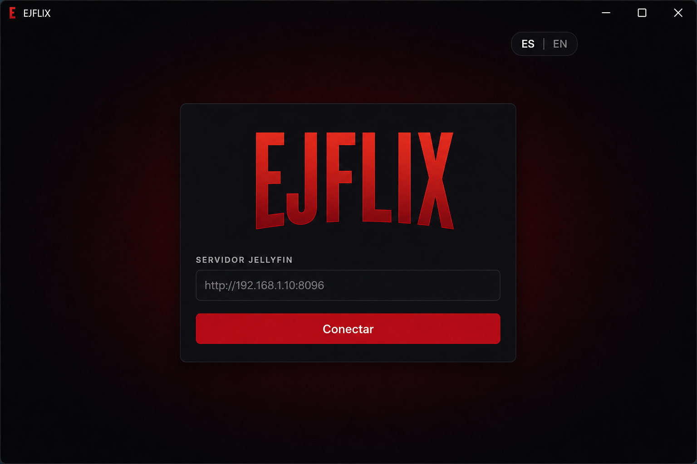
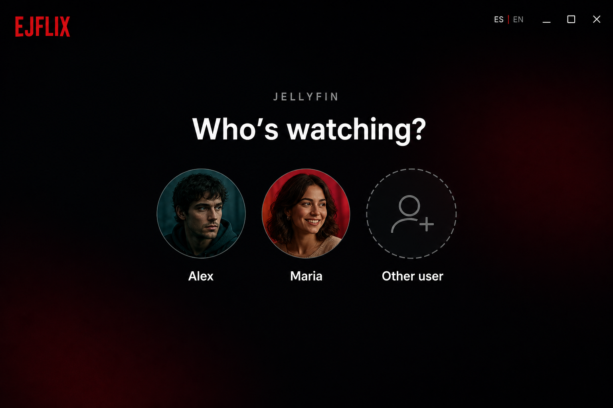
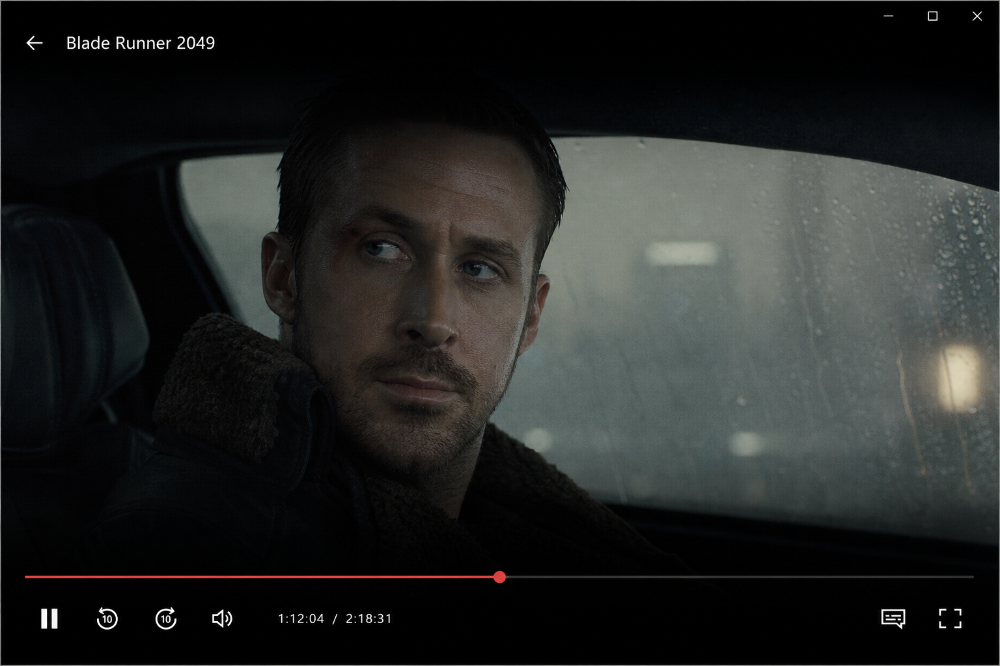

# ejFlix

A lightweight Jellyfin client for Windows 11 that also works without a server. Netflix-style browsing and native Direct Play through mpv: 4K, HDR, and the original codec, without transcoding. Online mode plays Stremio addon sources (AIOStreams, Torrentio with debrid…) straight in mpv.

The interface is available in **Spanish** and **English** (ES / EN control on the welcome, sign-in and profile screens, and in Settings › Language). Installed copies check GitHub Releases on launch and update themselves in one click.


## Screenshots

| Connect | Profiles |
| --- | --- |
|  |  |

| Home | Player |
| --- | --- |
|  |  |

<!-- Pending captures for 0.3 (drop the files in docs/screenshots/ and uncomment):
| Welcome | Discover |
| --- | --- |
|  |  |

| Details | Settings |
| --- | --- |
|  |  |
-->

## Features

- First launch asks how you want to use the app: **with a Jellyfin server** (enter the URL, pick a user) or **online with addons** (create a local profile, no server needed). Both kinds of profile share the same "Who is watching?" screen
- Local profiles have a name, a picture (preset gradient or an uploaded photo) and an optional 4-digit PIN; they can link a Jellyfin account later from Settings › Account and keep their own settings and progress
- Saved server, profiles, and session (the access token is encrypted with Windows DPAPI)
- Home with a hero carousel (parallax, auto-advance, drag or arrow keys) that mixes your server's newest titles with the addon catalogs, continue watching, next up, My list, recently added (with a "New" tag for the last 14 days), addon rows and genre rows
- Glass header with springy tabs: Home, My server (server content only), your pinned Jellyfin libraries (add them with the "+"), Discover and My list
- Discover tab: movies or series, filtered by genre and year, across the server (with popular / newest / year / name sorting) and every addon catalog that supports the genre filter; server copies win over online duplicates
- Full details page for movies and series: backdrop tinted with its dominant colour, logo, meta chips, expandable synopsis, season chips with the episode list, circular cast avatars, chapters, "More like this" and production info; pages stack so you can browse from one title to another and come back
- Skip intro / recap / credits: data from the Jellyfin media segments (10.10+, filled by the Intro Skipper or TheIntroDB plugins) with the public IntroDB community database as a fallback for series with an IMDb id; each kind can be "ask", "automatic" or "off"
- Next-episode card at the start of the credits (or in the last 30 s) with a configurable countdown (manual, 5, 10 or 15 s)
- Player chrome in the Nuvio style: centred pill toolbar (aspect ratio, speed, subtitles, audio, episodes), lockable controls, paused-state info card, episode and version panel inside the player
- Netflix-style timeline: scene previews on hover (Jellyfin trickplay or chapter images), drag to scrub, buffered indicator, chapter markers and intro/credits bands
- Preferred audio and subtitle language, remembered playback speed, remaining-time toggle
- My list (Jellyfin favourites) and mark as watched / unwatched for movies, series, seasons and episodes
- Settings per profile: 12 accent themes (Crimson, White, Gold, Jade, Rose gold, Arctic, Graphite, Ocean, Violet, Emerald, Amber, Rose), AMOLED black, poster size, playback preferences, app language, account
- Stremio addons: load any `manifest.json` (AIOStreams, Torrentio…) to get catalog rows on Home and online sources played straight in mpv, with local resume and automatic next episode
- Search across the server and the searchable addon catalogs, results grouped as "My server" and "Online", with recent queries
- Discord Rich Presence (Settings › Discord): shows what you are watching with poster, time remaining and paused state; the two text lines are templates
- Language selector: Spanish and English
- Native playback: Direct Play, hardware decode, HDR when Windows HDR is on

### Skip intro requirements

The player looks for intro, recap and credits ranges in this order:

1. Jellyfin media segments (server 10.10 or newer). Install the [Intro Skipper](https://github.com/intro-skipper/intro-skipper) or [TheIntroDB](https://github.com/TheIntroDB/jellyfin-plugin) plugin on the server and run its analysis task; on older servers the Intro Skipper API is queried directly.
2. [IntroDB](https://introdb.app), a public community database, for episodes of series that have an IMDb id in Jellyfin. Requests go out from the app itself, never through the server, and stop for five minutes if the service is slow or down.

Without any of them the player behaves as before: the "next episode" card appears in the last 30 seconds.

### Online mode (no server)

Pick "Watch online with addons" on the welcome screen and create a profile. Home, Discover and Search are then fed by the addon catalogs (Cinemeta is built in for the popular rows); add your own `manifest.json` in Settings › Addons to get sources. The profile can connect a Jellyfin server at any time from Settings › Account; the library then appears next to the addons and the "My server" and "My list" tabs show up. Local profiles, their PIN and their linked account live in the app data store; the linked token is encrypted like a normal session.

### Discord Rich Presence

Settings › Discord turns it on. The app talks to the Discord client on this PC through its local IPC pipe (no SDK, no extra process) and shows "Watching ejFlix" with the title, episode, poster and time remaining. The two lines are templates with `{title}`, `{episode}`, `{year}`, `{type}` and `{source}`; you can hide the poster or the time and decide whether the presence stays while paused. It ships with ejFlix's own Discord application, so the card reads "ejFlix" and the status line "Watching <title>" (configurable: title, second line or app name); paste another Application ID in Settings › Discord if you want a different name or icon. Posters are fetched by Discord itself, so a server that is only reachable on your LAN will not show its images (online titles do).

### Updates

On launch (four seconds after boot, and only if "Check for updates on launch" is on in Settings › Account) the app asks the public GitHub API for the latest release of this repository. If the tag is newer than the running version, a dialog shows the release notes and offers "Download and install": the `*-setup.exe` asset is downloaded to `%TEMP%\ejflix-update\` with a progress bar, then launched in passive mode (`/P /R /UPDATE`), which closes ejFlix, installs and reopens it. "Skip this version" silences that release; "Check now" in Settings always asks again. Nothing is sent to GitHub besides the request itself, and no token is involved.

### Stremio addons (online sources)

Settings › Addons accepts the `manifest.json` URL of any Stremio addon (`https://…/manifest.json` or `stremio://…`), for example an AIOStreams or Torrentio configuration that already carries your debrid key. What you get:

- The addon's catalogs appear as rows on Home (after "Recently added") and feed the hero, the Discover tab and the search page.
- Opening a title shows its metadata (from the addon, or from Cinemeta as a fallback) with seasons and episodes; pressing Play lists the streams of every addon that serves that title and plays the chosen one in mpv without downloading anything.
- Jellyfin movies and episodes with an IMDb id get an "Online sources" button, handy for episodes your library is missing.
- Progress of online titles is remembered locally per profile ("Continue watching (online)" row), the next episode chains automatically preferring the same addon and binge group, and intro/credits skipping works through IntroDB by IMDb id.
- Only http(s) streams are playable directly: raw torrents (`infoHash`) and external links are listed but disabled. With a debrid-backed addon the streams are plain http(s).
- Cinemeta is built in for the "Popular" rows and metadata; switch it off in the same section if you only want your own addons.

The Jellyfin access token is never sent to addon hosts; only the headers an addon asks for (`behaviorHints.proxyHeaders`) go with the stream request.

### Audio and Discord screen share

mpv always outputs stereo (`--audio-channels=stereo` with a normalised downmix), so 5.1/7.1 tracks keep their dialogue when Discord captures the app. This applies to Jellyfin files and to online streams alike, because both go through the same mpv instance.

Scene previews need trickplay images generated on the Jellyfin server (Jellyfin 10.9+): enable "Trickplay image extraction" in the library settings (Dashboard → Libraries → your library), review Dashboard → Playback → Trickplay, then run the "Generate Trickplay Images" scheduled task once. Without them the player falls back to chapter images, then to a plain time tooltip with the chapter name from the file.

"Recently added" follows Jellyfin's `DateCreated`. If your library uses the file creation date as "date added", set the library's "Date added behavior for new content" to "Use date scanned into the library" so new imports show up first.

## Requirements

- Windows 11
- A reachable Jellyfin server, or Stremio addons with http(s) streams (a debrid-backed AIOStreams / Torrentio configuration)
- [mpv](https://mpv.io/) for local builds (`C:\mpv\mpv.exe` or `src-tauri/resources/mpv.exe`)

To develop from source you also need:

- [Node.js](https://nodejs.org/) 20+
- [Rust](https://rustup.rs/) with the MSVC toolchain
- Visual Studio Build Tools or Community with C++

## Install

Use the NSIS installer from [Releases](../../releases) (`ejFlix_*_x64-setup.exe`). It installs per-user and does not require admin.

After install, choose "I have a Jellyfin server" and enter its URL (for example `http://192.168.1.10:8096`), or "Watch online with addons" and create a profile.

## Development

```bash
npm install
npm run prepare-mpv
npm run tauri dev
```

If the repo lives on a network drive, set `CARGO_TARGET_DIR` to a local folder before compiling.

## Build the installer

```bash
npm run prepare-mpv
npm run tauri build
```

The NSIS package is written to `src-tauri/target/release/bundle/nsis/` (or `$CARGO_TARGET_DIR/release/bundle/nsis/`).

Do not commit `mpv.exe`, `release/`, or `session.json`. Those paths are in `.gitignore`.

## Publish a release

Installed copies look for updates at `github.com/ej3mpl0/ejflix/releases/latest`, so a release only needs a `vX.Y.Z` tag and the installer attached. Bump the version in `package.json`, `src-tauri/tauri.conf.json`, `src-tauri/Cargo.toml` and `CLIENT_VERSION` in `src-tauri/src/jellyfin.rs`, commit, then:

```powershell
powershell -ExecutionPolicy Bypass -File scripts/publish-release.ps1              # build, copy to release/, gh release create
powershell -ExecutionPolicy Bypass -File scripts/publish-release.ps1 -SkipBuild   # reuse the last build
powershell -ExecutionPolicy Bypass -File scripts/publish-release.ps1 -Notes notes.md
```

The script needs the GitHub CLI signed in (`gh auth login`). Without `-Notes` the release body is GitHub's generated changelog; the app shows that body as the update notes, so plain markdown with `##` headings and `-` bullets reads best.

## Language

The ES / EN control is on the login and profile screens and in Settings › Language. The choice is stored with the app data and restored on the next launch. If nothing is saved yet, the app follows the Windows UI language (`en*` to English, otherwise Spanish).

## Settings

Settings live per profile in the app data store (`settings.<userId>` in `session.json`) and apply to both the main window and the player overlay at once. Open them with the gear in the header or from the avatar menu; Escape or the mouse back button returns to the previous view.

## Player shortcuts

| Key | Action |
| --- | --- |
| Space / K | Play / pause |
| Left / Right, J / L | Seek 10 seconds |
| 0–9 | Jump to 0%–90% |
| Home / End | Jump to the start / near the end |
| Up / Down, mouse wheel | Volume |
| M | Mute |
| < / > | Playback speed down / up |
| Enter / S | Skip the intro, recap or credits when the prompt is shown |
| N | Next episode |
| E | Episodes and versions panel |
| F, double-click | Fullscreen |
| Click on the video | Play / pause |
| Click on the time | Toggle elapsed / remaining |
| Esc | Close panel → close menu → leave fullscreen → exit player |

Locked controls (padlock in the top-right) ignore every key until you click the video and tap the unlock button.

## Security notes

- Passwords are not stored. Only the Jellyfin access token is kept, encrypted for the current Windows user.
- Image and stream URLs do not include `api_key`. Authenticated images go through a local protocol; mpv sends the token as a header.
- HTTPS certificates are validated on the public internet. Self-signed certificates are accepted only for localhost and private LAN addresses.
- The WebView cannot read the session store directly.

## License

Use and modify for your own Jellyfin server. Bundled mpv is subject to its own license.
